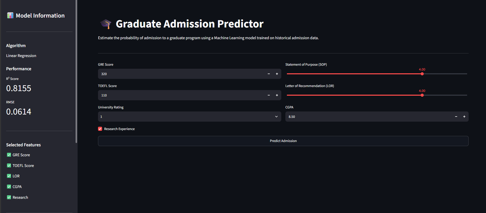
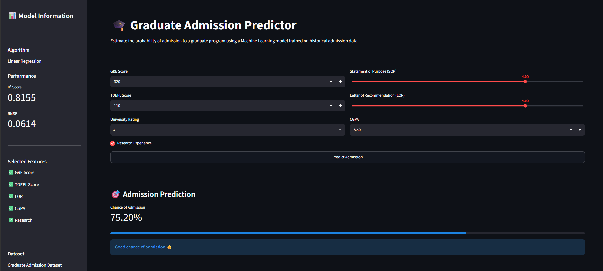

# 🎓 Graduate Admission Predictor

A Machine Learning web application that predicts the probability of admission to graduate programs based on a student's academic profile.

Built using **Python**, **Scikit-learn**, and **Streamlit**, this project demonstrates an end-to-end machine learning workflow—from data preprocessing and model training to deployment as an interactive web application.

---

## 📸 Application Preview

### Home Page

### Prediction Result

---

## 📌 Project Overview

Graduate school admissions depend on several academic factors such as GRE score, TOEFL score, CGPA, research experience, and recommendation strength.

This project uses a **Linear Regression** model trained on historical admission data to estimate a student's probability of admission.

The project follows a complete machine learning lifecycle:

- Data preprocessing
- Feature selection
- Model training
- Model evaluation
- Model serialization using Joblib
- Interactive prediction interface with Streamlit